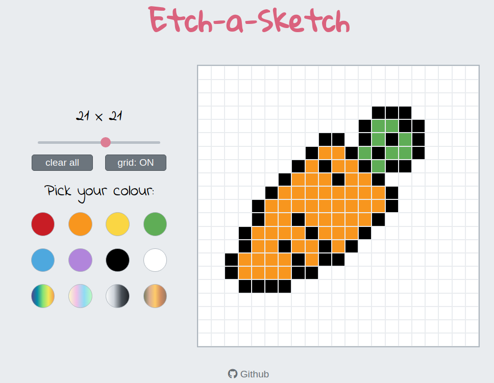

# Etch-a-Sketch
## Introduction

This project is a simple browser version of a pixelated sketchpad. It is built using the standard front-end stack of HTML, CSS and JavaScript.

The project primarily demonstrates and focuses on DOM manipulation.

## Preview

## Media credits:

1. Flaticon: https://www.flaticon.com/free-icons/sketch